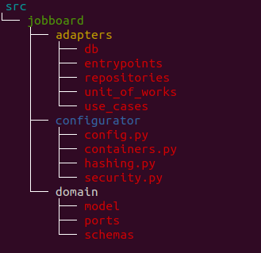

# FastAPI JobBoard with Hexagonal Architecture - WIP - Work In Progress

JobBoard project with FastAPI using Hexagonal Architecture.

Rewritten version of: [JobBoard](https://github.com/nofoobar/JobBoard-Fastapi)

## About Hexagonal Architecture

You can read it from original author:

[The Pattern: Ports and Adapters](https://alistair.cockburn.us/hexagonal-architecture/)

Why Hexagonal?

* Easy to implement.
* Highly testable and maintainable code.
* Dependency Inversion, Dependency Injection and SRP in the club.
* Centered domain knowledge.
* The original author is quite friendly :)

## Project folder structure

## How to install?

We use flit for the installation:

Install flit:

* `pip install flit==3.7.1`

### Installing project for development

`make install-dev` or `flit install --env --deps=develop --symlink` 

### Installing for general showcase

`make install` or `flit install --env --deps=develop` 

## How to run?

`make run` 

or 

`uvicorn src.jobboard.adapters.entrypoints.application:app --reload`

### Run all tests in verbose

`make test` or `pytest -svv` 

### Run all tests with html coverage

`make test-cov` or `pytest --cov-report html --cov=src tests`

## Database migrations

Generated as:

`make migrations`

or

`alembic -c src/jobboard/adapters/db/alembic.ini revision --autogenerate`

Migrate:

`make migrate`

or

`alembic -c src/jobboard/adapters/db/alembic.ini upgrade head`